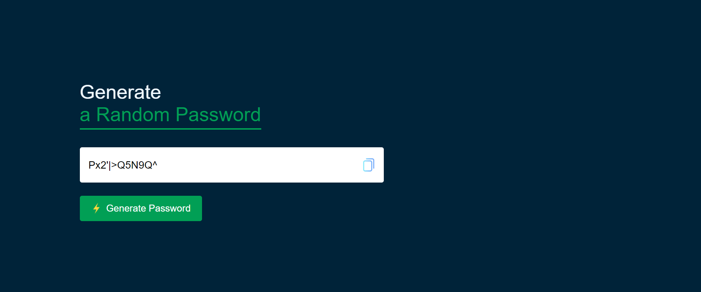

# 🔑 Random Password Generator

A simple random password generator ✨  
Generates a strong password with **uppercase letters, lowercase letters, numbers, and symbols**.

## 📸 Project Preview


## 🚀 Features
- Generates a **12-character** random password.
- Includes **uppercase, lowercase, numbers, and symbols**.
- Simple and clean **UI design**.
- Easy to use and copy the password.

## 🎯 How to Use
1. Click the **"Generate Password"** button.
2. A random password will be generated instantly.
3. Copy the password and use it wherever needed.

## 🔧 Technologies Used
- **HTML** 📄
- **CSS** 🎨
- **JavaScript** ⚡

## 📂 Run the Project
1. Clone the repository using:
   ```bash
   git clone https://github.com/your-username/repository-name.git
